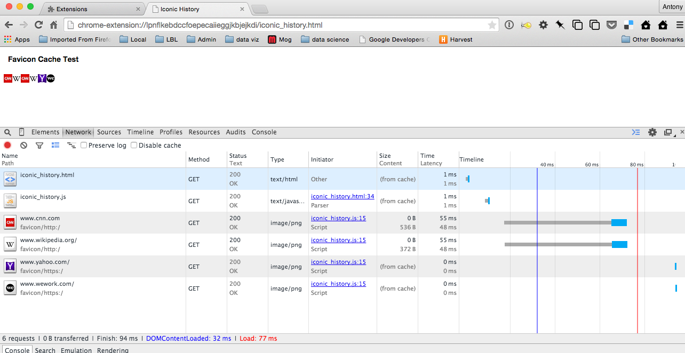

### FavIconTest Chrome Extension

This is a minimal Chrome Extension to demonstrate a performance issue when loading Favicons in a Chrome Extension.

**What I Expect To Happen:** I would expect all accesses to "chrome://favicon/" URLs from within a Chrome Extension to be fulfilled from Chrome's favicon cache whenever possible.

**What Actually Happens:** Favicon accesses within certain callbacks (such as `chrome.history.search`) are fulfilled from the cache; Favicon accesses outside these callbacks are not fulfilled from cache.

## To Install and Reproduce The Issue

1. Clone or unzip this repository and load it as an unpacked extension (in `chrome://extensions`).

2. Find the Extension's ID in its entry on `chrome://extensions` (a long string like `'lpnflkebdccfoepecaiieggjkbjejkdi'`).

3. Construct the URL to open the extension's `iconic_history.html` page using the ID, and open this in a new tab.  For example:  `'chrome-extension://lpnflkebdccfoepecaiieggjkbjejkdi/iconic_history.html'`.

4. Open Developer Tools, select 'Network', and Reload the page.  You should see something like this:

Note in the timeline that the first two favicons (CNN and Wikipedia) are not from the favicon cache, while the latter two items (yahoo and wework) are served from the cache.  You may have to open the four URLs used for testing here to prime the favicon cache -- see [iconic_history.js]('iconic_history.js') for the exact URLs.

This behavior is consistent across repeated reloads of the page.